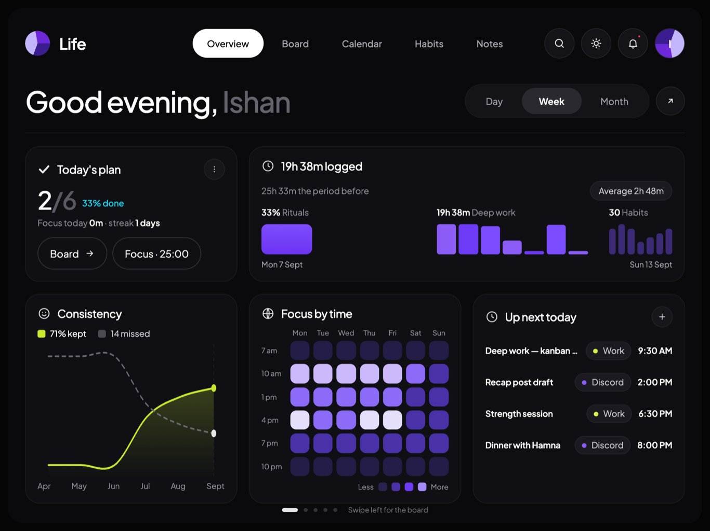
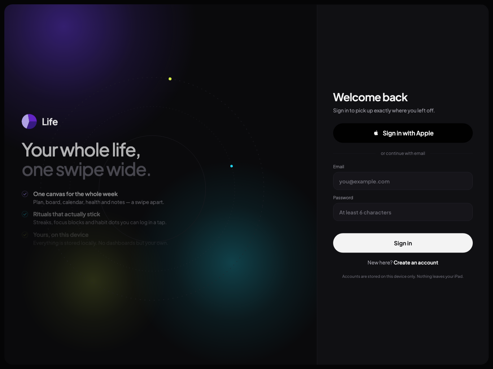
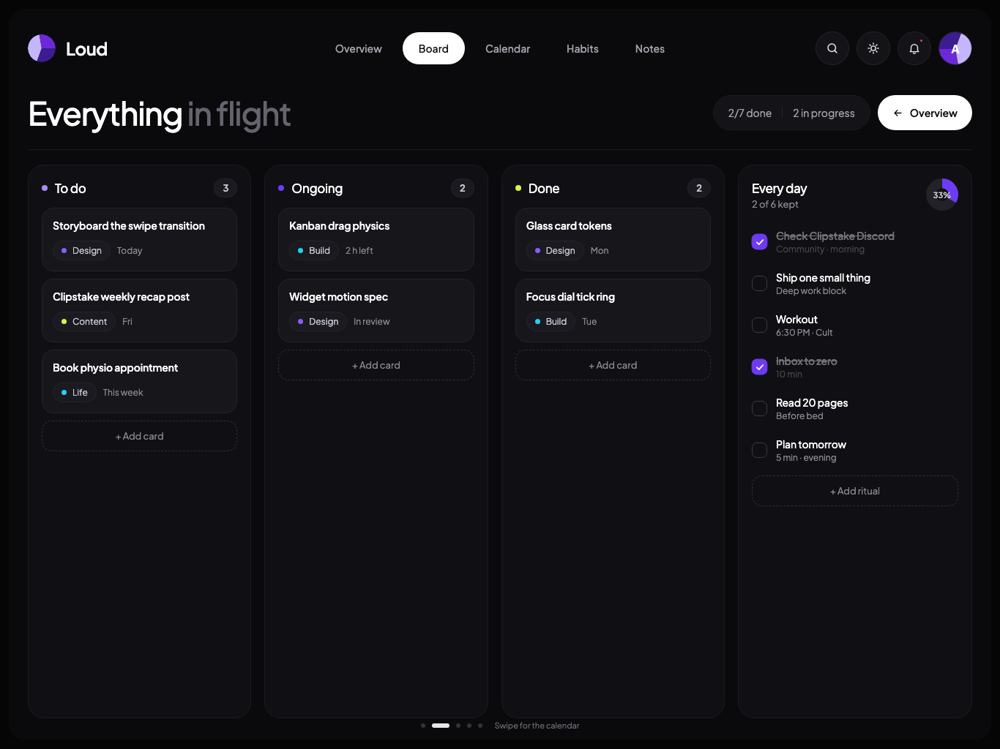
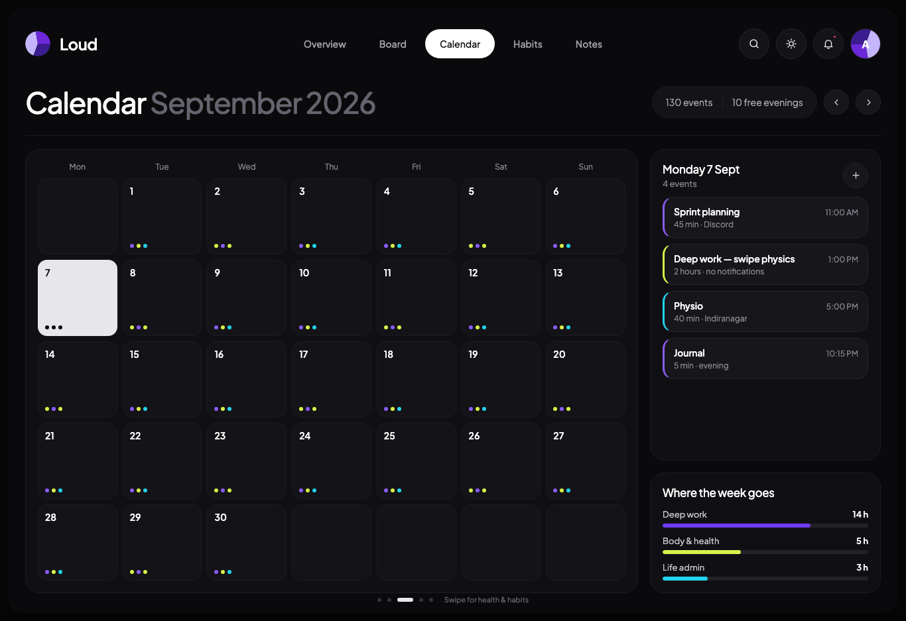
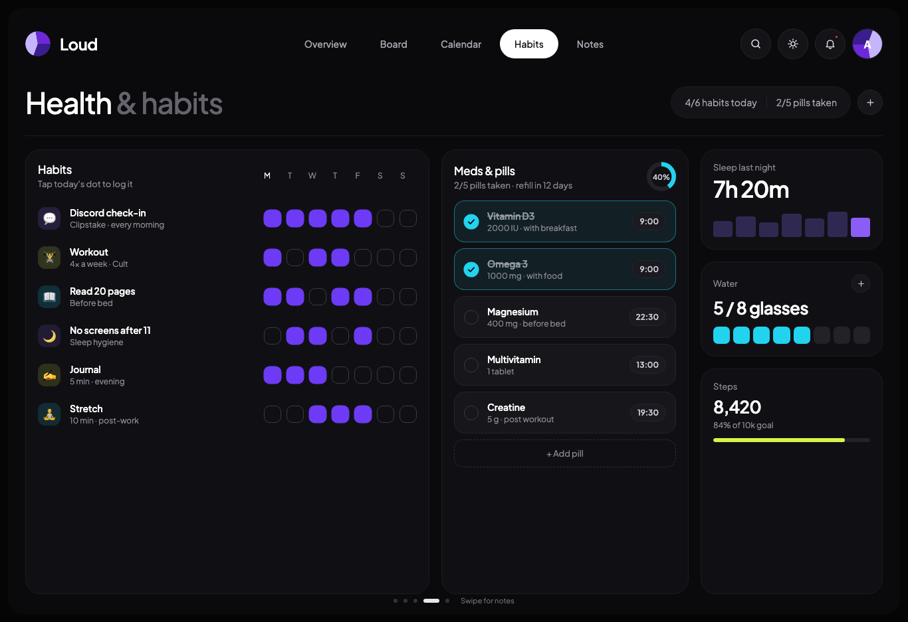
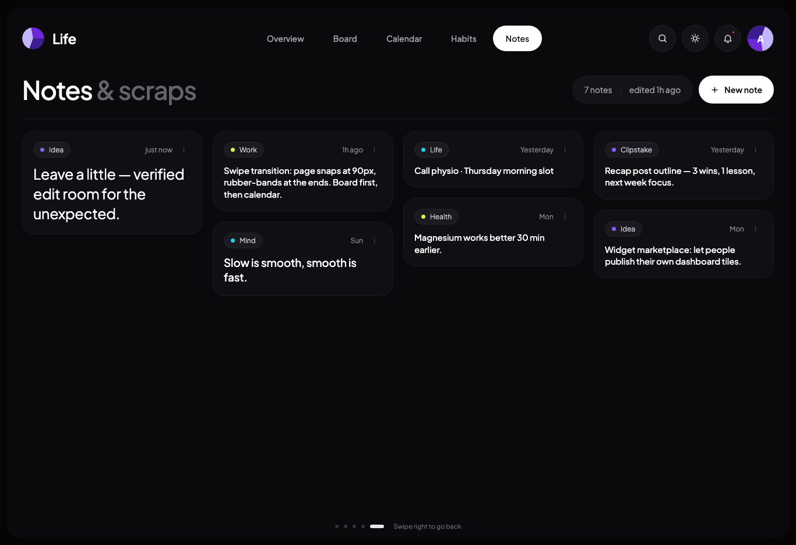
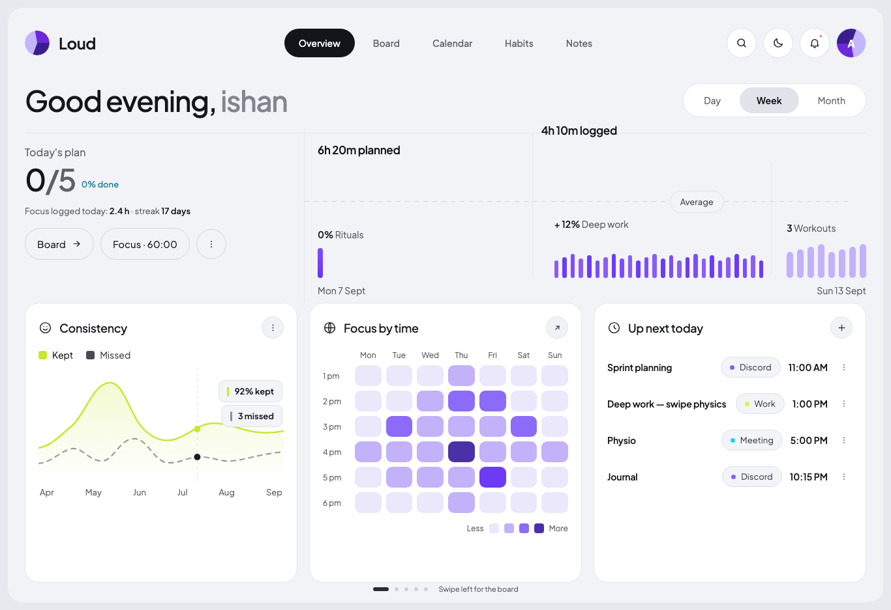

# Life

**App Store listing name: _Life: Daily Planner & Habits_** (28 of the 30 characters Apple
allows). `expo.name` stays `Life` so the home-screen label under the icon is not truncated.

A life dashboard built with Expo (SDK 57) and React Native, replicated end to end from the
`Life Dashboard Dark.dc.html` Claude Design file: five full-bleed pages you swipe between,
dark and light themes, and local-first data for everything you track.



## What's in it

| Page | What it does |
| --- | --- |
| **Overview** | Greeting, day/week/month range, today's plan, focus timer, today's protein against your goal, deep-work bars, consistency chart, focus heatmap and today's agenda. |
| **Board** | Three-column kanban with long-press drag between columns, per-card editing, plus the "Every day" ritual checklist and its progress dial. |
| **Calendar** | Month grid with event dots and the day's protein grams, month navigation, a day detail pane with full event CRUD and a per-day protein log, and where the week went. |
| **Habits** | Weekly habit dot grid, meds & pills with a progress ring, sleep, water and step tiles. |
| **Notes** | Masonry note wall with inline editing, tags and sizes. |

Plus a sign-in screen (**Sign in with Apple** and email) and a six-step onboarding flow
that asks what you're chasing and seeds your rituals, focus block length and health goals
(water, protein and steps).

## Running it

```bash
npm install
npm run ios      # iPad simulator (landscape)
npm run web      # browser preview
```

It runs anywhere: the design's landscape-iPad canvas is exact at tablet width and rebuilt
below it, down to a phone in either orientation.

## How it is put together

```
src/
  auth/        sign-in screen, Apple button, animated aurora backdrop, onboarding
  components/  pager, header, sheet, widget grid, icons and the UI primitives
  pages/       the five dashboard pages
  widgets/     the thirteen home-page widgets and their registry
  state/       zustand stores persisted to AsyncStorage, plus the derivations
  theme/       design tokens for both themes, the layout scale, easing curves
```

**Widgets.** The home page is `widgets` in the store — an ordered list of keys — over a
grid that packs them onto shelves the way an iOS home screen fills a page. Each widget
declares a column span and a row height in `src/widgets/registry.tsx` and knows nothing
about breakpoints; the grid clamps the span to however many columns the window has, so
the same set reflows from four columns down to one.

Slots are positioned absolutely rather than laid out by flexbox, because a widget being
dragged has to keep following the finger from where it was picked up while the order
underneath it changes. The hit test runs on the UI thread against a shared copy of the
slot rectangles and only crosses to JS when the target slot actually changes; the rest
spring to their new slots, and the order is committed to the store on drop.

**Motion.** Every transition in the design maps to a token in `src/theme/motion.ts`:
`cubic-bezier(.22, 1, .36, 1)` for settles, `cubic-bezier(.34, 1.56, .64, 1)` for the
springy presses. The pager reproduces the prototype's gesture exactly — 90px snap
threshold, 0.28 rubber-banding at the ends, and a velocity-aware fling.

**Layout.** `src/theme/layout.ts` resolves the window once into one breakpoint and hands
it down by context, the way the theme is: gutters, gaps, card padding, header height, grid
columns, masonry columns and the shell inset all come from it, and `<Txt>` passes every
size through `scaleType`. Type does not scale linearly — a 44px title has room to shrink
on a phone, a 12px axis label does not — so display sizes take the full multiplier and
body sizes take a fraction of it. Multi-pane pages route through one `<Panes>` that lays
them out side by side or stacks them into a single scroll.

**Theming.** Everything visual resolves through `src/theme`, which is the single source
of truth and is re-exported from one barrel (`import { accent, radius, space, useTheme }
from '@/theme'`):

| File | Holds |
| --- | --- |
| `tokens.ts` | The two palettes. The design drives colour through CSS custom properties with dark values as inline fallbacks and a `LIGHT` override map; both sets are transcribed here, plus a few tokens the design hardcoded (heatmap legend, muted bars) so they survive the theme flip. |
| `layout.ts` | The breakpoints and everything that changes with the window, plus `scaleType`. |
| `scale.ts` | Radii, spacing, type sizes, tracking and the component heights that do not change. The design is not on an 8pt grid — it uses a specific set of values (26px gutters, 22px card radius, 9px chips) — so they are named rather than repeated as literals. |
| `motion.ts` | The easing curves and durations lifted from the design's CSS transitions. |
| `ThemeProvider.tsx` | Resolves the active theme once and hands it down by context. |

`useTheme()` reads context, not the store. Hundreds of components need the palette, and
subscribing each one to zustand would mean every subscriber re-evaluating on unrelated
updates — the focus timer alone ticks once a second.

**Render cost.** A few places are deliberately tuned: the focus countdown subscribes in a
leaf component so no other widget re-renders once a second for it; habit,
pill and note rows are memoised so toggling one does not re-render its siblings; and the
note editor is uncontrolled, so typing a long note costs no re-renders and no per-keystroke
write to AsyncStorage.

**Sheets.** Every create/edit affordance — tasks, cards, events, habits, pills, notes,
account — routes through one `SheetProvider` in `src/components/Sheet.tsx`. It is presented
with [`insyd-bottom-sheet`](https://www.npmjs.com/package/insyd-bottom-sheet)'s
`SmoothSheet`, which brings the drag handle, drag-to-dismiss, backdrop tap and keyboard
avoidance. `<SheetHost>` is mounted in `App.tsx` below `ThemeProvider` so portaled sheet
content still resolves the palette.

**Protein.** Every logged item — a label and its grams, tagged Meal, Shake or Snack — is
bucketed by `YYYY-MM-DD` in `protein`, exactly the way `events` is, so the tracker and the
calendar are the same data seen twice: the month grid prints each day's total, the day pane
logs against it, and the overview shows today's. The daily goal comes from onboarding and is
retunable by tapping any total. Days before today are backfilled once per month, the same as
the sample agenda; today and everything ahead of it start empty.

**Numbers.** Nothing on screen is a figure typed into a component. Everything is a dated
log keyed `YYYY-MM-DD`: `focusLog` holds seconds per hour of the day (hour resolution is
what the heatmap needs, and daily totals fall out by summing), alongside `habitLog`,
`protein`, `waterLog`, `stepLog` and `sleepLog`. `src/state/metrics.ts` turns them into
what screens show — daily series, the weekday-by-band heat ramp, streaks, the week-on-week
trend, a habit's week, kept-versus-missed per month — and every function there is pure, so
the same log always reads the same way. A new account is seeded with eight weeks of
history into those same logs, from a deterministic wobble rather than `Math.random`, and
it stops at yesterday.

**Data.** There is no backend. Two zustand stores persist to `AsyncStorage`: one for the
dashboard, one for the account and onboarding answers. Sign in with Apple uses
`expo-apple-authentication` when the device supports it; email accounts are local.

## Scripts

```bash
npm run typecheck   # tsc --noEmit
npm run lint        # eslint (expo config + typescript-eslint)
npm run ios
npm run android
npm run web
```

## Screens

| Sign in | Board |
| --- | --- |
|  |  |

| Calendar | Habits |
| --- | --- |
|  |  |

| Notes | Light theme |
| --- | --- |
|  |  |

## Building for a device

```bash
npx eas build --profile preview --platform ios     # internal / simulator build
npx eas build --profile production --platform ios  # store build
```

Sign in with Apple needs a real build (it is unavailable in Expo Go and on web); the
screen falls back to email with a clear message when it is not supported.
